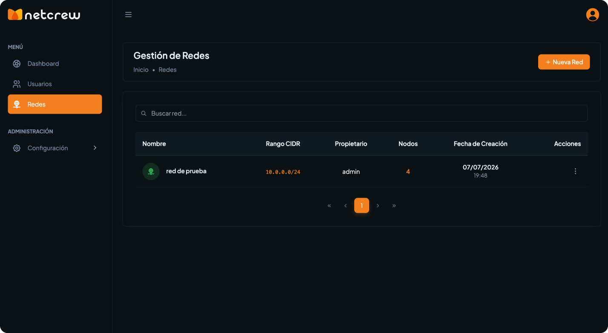
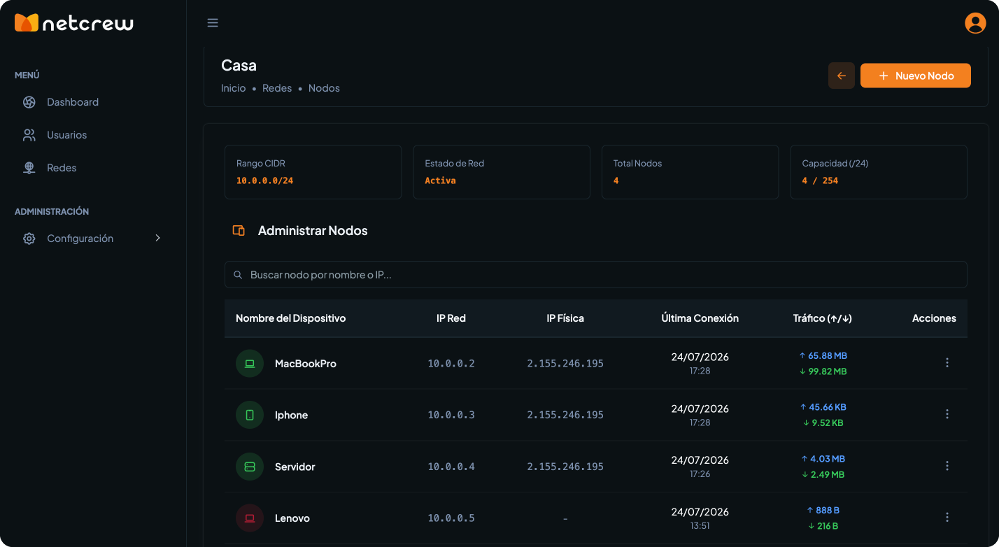
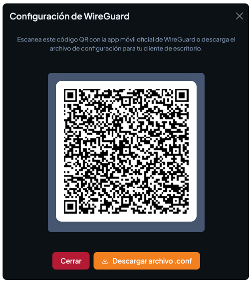
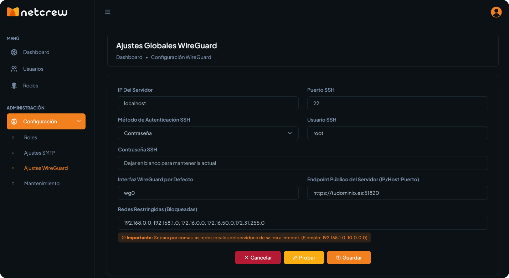
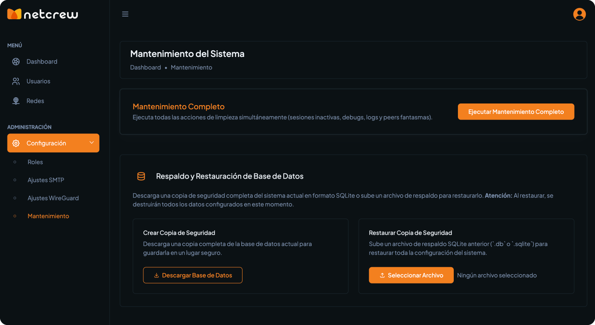
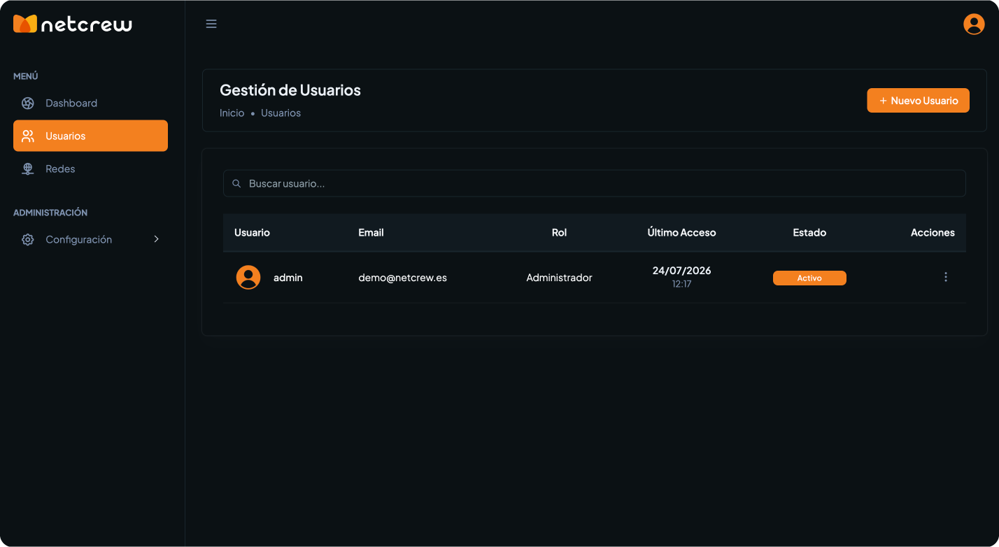
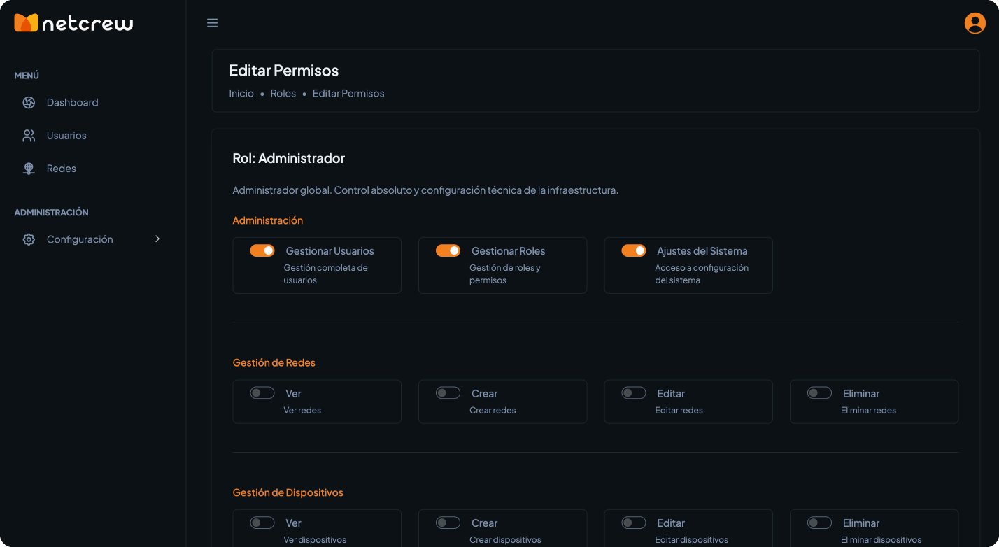

# 🚀 NetCrew - Centralized WireGuard VPN Manager

<p align="center">
  
  <br>
  <b>Plataforma Open Source de Administración Centralizada para Redes VPN basadas en WireGuard.</b>
  <br><br>
  <a href="https://github.com/fredeabal/netcrew/releases"></a>
  <a href="https://www.php.net/"></a>
  <a href="https://codeigniter.com/"></a>
  <a href="https://www.wireguard.com/"></a>
  <a href="LICENSE"></a>
</p>

---

## 🚀 Instalación en 1 Paso

En cualquier servidor **Debian 11/12** o **Ubuntu 20.04 / 22.04 / 24.04** limpio con acceso root (VPS o máquina virtual), ejecuta el siguiente comando en tu terminal:

```bash
bash <(curl -s https://raw.githubusercontent.com/fredeabal/netcrew/main/install.sh)
```

El script se encargará automáticamente de todo el proceso de instalación y configuración del servidor.

### 🔑 Credenciales por Defecto tras la Instalación
* **URL:** `http://TU_IP_O_DOMINIO`
* **Email:** `admin@demo.com`
* **Password:** `admin1234`

---

## 🔄 Actualizar a la última versión

Para actualizar un servidor NetCrew existente a la última versión disponible (sin perder tus configuraciones, redes o bases de datos), simplemente ejecuta:

```bash
bash <(curl -s https://raw.githubusercontent.com/fredeabal/netcrew/main/update.sh)
```

---

## 💡 ¿Qué es NetCrew?

**NetCrew** es un potente **Control Plane** (panel de administración centralizado) autohospedado para redes VPN **WireGuard**. Permite coordinar topologías de red **Hub-and-Spoke**, generar automáticamente archivos de configuración `.conf` y códigos QR para clientes, gestionar dispositivos en tiempo real vía SSH y proteger los accesos mediante un sistema robusto de permisos y roles (RBAC).

El servidor NetCrew interconecta dispositivos ubicados detrás de cualquier NAT o cortafuegos sin necesidad de abrir puertos en las máquinas cliente ni realizar configuraciones manuales complejas.

---

## ✨ Características Principales

### 🌐 Gestión de Redes, Nodos y Topología
* **Arquitectura Hub-and-Spoke:** Los nodos se conectan centralizadamente al servidor WireGuard, permitiendo la interconexión transparente entre ellos.
* **Asignación IP Inteligente:** Cálculo y prevención de colisiones dentro del rango CIDR asignado a cada red.
* **Despliegue al Instante:** Descarga directa de archivos de configuración `.conf` y lectura mediante **código QR** para dispositivos móviles (iOS, Android) y de escritorio (Windows, macOS, Linux).

**Gestión de Redes**
<p align="center">
  
</p>
**Gestión de Nodos**
<p align="center">
  
</p>
**Importar Configuración al Cliente**
<p align="center">
  
</p>

### ⚡ Sincronización & Mantenimiento en Tiempo Real
* **Integración SSH Segura:** Sincronización automatizada de peers con el motor WireGuard usando `phpseclib3`.
* **Limpieza de Peers Fantasma:** Eliminación en memoria de sesiones inactivas y peers eliminados del panel.
* **Mantenimiento en 1 Clic:** Limpieza integrada de logs, base de datos y control de servicios.

**Ajustes WireGuard**
<p align="center">
  
</p>
**Mantenimiento del Sistema**
<p align="center">
  
</p>

### 🛡️ Seguridad Avanzada y Roles (RBAC)
* **Gestión de Permisos Modular:** Integración nativa con **CodeIgniter Shield** para definir roles granulares (`superadmin`, `supervisor`, `user`).
* **Encriptación de Extremo a Extremo:** Almacenamiento seguro en base de datos para llaves privadas de WireGuard y credenciales SSH.
* **Protección Anti-CSRF:** Filtros activos en todos los formularios y endpoints del sistema.

**Gestión de Usuarios**
<p align="center">
  
</p>
**Gestión de Permisos (RBAC)**
<p align="center">
  
</p>


---

## 🛠️ Stack Tecnológico

| Componente | Tecnología |
| :--- | :--- |
| **Backend Core** | CodeIgniter 4.x (PHP 8.2+) |
| **Autenticación** | CodeIgniter Shield |
| **Base de Datos** | SQLite3 |
| **Protocolo VPN** | WireGuard / `wireguard-tools` |
| **SSH Client** | `phpseclib3` |
| **Frontend** | Bootstrap 5, SweetAlert2, Tabler Icons |

---

## 🔒 Exención de Responsabilidad

- **Privacidad Local:** NetCrew no recopila ni transmite información a servidores externos. Toda la configuración se almacena localmente en tu propio servidor.
- **Responsabilidad:** El usuario es el único responsable de la seguridad de su infraestructura y de realizar copias de seguridad de sus archivos de datos y llaves SSH.
- **Licencia:** Distribuido "tal cual" (As Is) bajo la licencia MIT.

---

## 🤝 Contribuciones y Soporte

¡Las contribuciones son bienvenidas! Si encuentras un fallo o tienes una idea para mejorar NetCrew:
1. Haz un **Fork** del repositorio.
2. Crea una rama para tu característica (`git checkout -b feature/nueva-funcion`).
3. Envía tus cambios mediante un **Pull Request**.

Si el proyecto te resulta útil, ¡considera darle una ⭐️ en GitHub!
